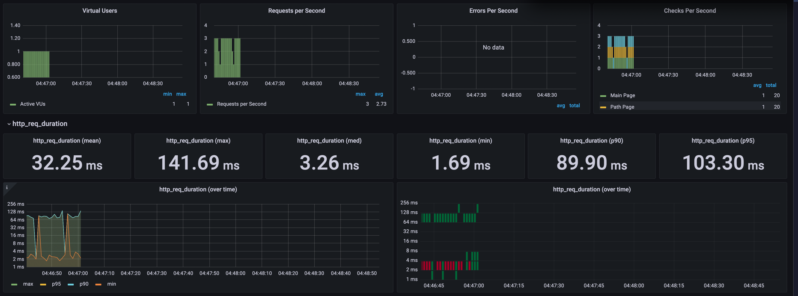

<p align="center">
    
</p>
<p align="center">
  
  
  <a href="https://edu.nextstep.camp/c/R89PYi5H" alt="nextstep atdd">
    
  </a>
  
</p>

<br>

# 인프라공방 샘플 서비스 - 지하철 노선도

<br>

## 🚀 Getting Started

### Install

#### npm 설치

```
cd frontend
npm install
```

> `frontend` 디렉토리에서 수행해야 합니다.

### Usage

#### webpack server 구동

```
npm run dev
```

#### application 구동

```
./gradlew clean build
```

<br>

### 1단계 - 웹 성능 테스트

1. 웹 성능예산은 어느정도가 적당하다고 생각하시나요

> 경쟁사 대비 20% 이상의 성능차이를 나지 않게 한다.

#### 메인 페이지 접속 시 지표

- 경쟁사 지표(데스크탑 기준)

| 측정 지표       | 네이버 지도 | 카카오 맵 |
|-------------|--------|-------|
| FCP         | 0.6초   | 0.5초  |
| TTI         | 0.6초   | 0.7초  |
| Speed Index | 2.2초   | 2.4초  |
| TBT         | 0초     | 0초    |
| LCP         | 1.4초   | 1.2초  |

- Running Map(데스크탑 기준)

| 측정 지표 | 현재 지표 | **_`목표`_**  |
|-------|-------|-----|
| FCP         | 2.7초  | 0.7초|
| TTI         | 2.8초  | 0.7초|
| Speed Index | 2.9초  | 2.5초|
| TBT         | 50ms  | 0ms|
| LCP         | 2.8초  | 1.4초|


2. 웹 성능예산을 바탕으로 현재 지하철 노선도 서비스의 서버 목표 응답시간 가설을 세워보세요.
   - 네이버 지도 기준으로 메인 페이지 로드 속도가 6.9ms이고, 경로 탐색 시 응답 속도가 194.41ms 이므로,
우리 사이트의 메인 페이지는 7ms를 목표로하고, 경로 탐색 페이지는 200ms를 목표로 한다.

---

### 2단계 - 부하 테스트

1. 부하테스트 전제조건은 어느정도로 설정하셨나요
- web server
- was
- database
#### 시나리오
- 메인페이지 -> 경로탐색페이지 -> 경로 탐색

2.Smoke, Load, Stress 테스트 스크립트와 결과를 공유해주세요
#### 목표 rps
하루 평균 지하철 이용자 수 : 약 4,500,000 명
DAU 450,000명 (10%가 사용한다고 가정)
1명 당 1일 평균 접속 수 : 2번 (출근, 퇴근)
1일 총 접속 수 : 450,000 * 2 = 900,000
1일 평균 rps : 900,000 / 86400 =  10
1일 최대 rps : 10 * 2(피크 시간대 집중률 2배로 가정) = 20

#### VUser
R:3(메인 페이지 -> 경로 검색 페이지 -> 경로 검색)
http_req_duration =200ms(100~300ms 사이)
T = (3 * 200ms) + 1000ms = 1600ms

평균 VUser = (10*1.6)/3 = 5
최대 VUser = (20*1.6)/3= 10


### 1. smoke
```javascript
import http from 'k6/http';
import {check, group, sleep, fail} from 'k6';

export let options = {
  vus: 1,
  duration: '60s',

  threshold: {
    http_req_duration: ['p(99)<200'],
  },
};

const BASE_URL = 'https://choizz.o-r.kr/'

const main = function () {
  let mainRes = http.get(`${BASE_URL}`);
  check(mainRes, {
    'Main Page': res => res.status === 200,
  })
}

const path = function () {
  let pathRes = http.get(`${BASE_URL}/path`);
  check(pathRes, {
    'Path Page': res => res.status === 200,
  })
}

const search = function () {
   const max = 727; //지하철 역 id 최대값
   const min = 1;//지하철 역 id 최소값
   const randomNum = function callRandomNum(max, min) {
      return Math.floor((Math.random() * (max - min) + min));
   }
   let searchRes = http.get(`${BASE_URL}/paths?source=${randomNum(max, min)}&target=${randomNum(max, min)}`);
   check(searchRes, {
      'Search Path': res => res.status === 200,
   })
}
export default function () {
  main();
  path();
  search();

  sleep(1);
};
```


### 2. load
```javascript
import http from 'k6/http';
import {check, group, sleep, fail} from 'k6';

export let options = {
  stages: [
    {duration: '15s', target: 5},
    {duration: '1m', target: 5},
    {duration: '10s', target: 10},
    {duration: '1m', target: 10},
    {duration: '20s', target: 0},
  ],

  threshold: {
    http_req_duration: ['p(99)<200'],
  },
};

const BASE_URL = 'https://choizz.o-r.kr/'

const main = function () {
  let mainRes = http.get(`${BASE_URL}`);
  check(mainRes, {
    'Main Page': res => res.status === 200,
  })
}

const path = function () {
  let pathRes = http.get(`${BASE_URL}/path`);
  check(pathRes, {
    'Path Page': res => res.status === 200,
  })
}

const search = function () {
   const max = 727;
   const min = 1;
   const randomNum = function callRandomNum(max, min) {
      return Math.floor((Math.random() * (max - min) + min));
   }
   let searchRes = http.get(`${BASE_URL}/paths?source=${randomNum(max, min)}&target=${randomNum(max, min)}`);
   check(searchRes, {
      'Search Path': res => res.status === 200,
   })
}

export default function () {
  main();
  path();
  search();

  sleep(1);
};
```
!

### 3. stress
```javascript
import http from 'k6/http';
import {check, group, sleep, fail} from 'k6';

export let options = {
   stages: [
      {duration: '10s', target: 10},
      {duration: '1m', target: 10},
      {duration: '10s', target: 20},
      {duration: '1m', target: 20},
      {duration: '10s', target: 40},
      {duration: '1m', target: 40},
      {duration: '10s', target: 80},
      {duration: '1m', target: 80},
      {duration: '20s', target: 0},
   ],

   threshold: {
      http_req_duration: ['p(99)<200'],
      'Main Page': ['p(99)<7'],
   },
};

const BASE_URL = 'https://choizz.o-r.kr/'

const main = function () {
   let mainRes = http.get(`${BASE_URL}`);
   check(mainRes, {
      'Main Page': res => res.status === 200,
   })
}

const path = function () {
   let pathRes = http.get(`${BASE_URL}/path`);
   check(pathRes, {
      'Path Page': res => res.status === 200,
   })
}


const search = function () {
   const max = 727;
   const min = 1;
   const randomNum = function callRandomNum(max, min) {
      return Math.floor((Math.random() * (max - min) + min));
   }
   let searchRes = http.get(`${BASE_URL}/paths?source=${randomNum(max, min)}&target=${randomNum(max, min)}`);
   check(searchRes, {
      'Search Path': res => res.status === 200,
   })
}

export default function () {
   main();
   path();
   search();

   sleep(1);
};

```

---

### 3단계 - 로깅, 모니터링

1. 각 서버내 로깅 경로를 알려주세요
 //롬복 사용 콘솔 질문
> 회원가입과 로그인 로직에 파일 로그를 넣고 경로 탐색에 json 로그를 넣었습니다.

- /home/ubuntu/nextstep/infra-subway-monitoring/log/file.log
- /home/ubuntu/nextstep/infra-subway-monitoring/log/json.log

2. Cloudwatch 대시보드 URL을 알려주세요
